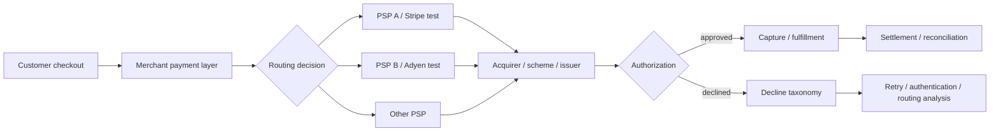

# EU Payments Acceptance Engine

[](https://github.com/layan985/eu-payments-acceptance-engine/actions/workflows/tests.yml)

A B2C payments analytics and integration project for diagnosing authorization loss, testing routing changes, and validating assumptions against the real European payments market.

> **Question:** when authorization differs across PSPs, markets, devices and authentication paths, how do you decide what to change without mistaking correlation for causal uplift?

The project combines three layers:

1. **official ECB market data** for the real European payments baseline;
2. a reproducible **300,000-transaction synthetic merchant environment** for transaction-level experiments;
3. credential-gated **Stripe and Adyen sandbox paths** for real PSP test-environment verification.

## Current European market context

The latest ECB release, for H2 2025, reports **83.5 billion** euro-area non-cash payments, cards at about **57%** of payment count, and **32.9 billion** contactless card payments. The joint EBA-ECB fraud report puts the 2024 EEA fraud rate at around **0.002% of transaction value** and finds SCA remains effective against the fraud types it was designed to mitigate.

See `ECB_MARKET_CONTEXT.md` and `ecb_market_snapshot.py`.

## Reproduced experiment results

| Metric | Seeded result |
|---|---:|
| Overall authorization rate | 93.10% |
| Germany / PSP_A | 93.03% |
| Germany / PSP_B | 89.31% |
| Raw Germany PSP gap | 372 bps |
| Randomized treatment-control gap | ~248 bps |
| 95% CI on randomized gap | ~191–305 bps |

The 372 bp observational gap is **not** described as uplift. It identifies where to investigate. The randomized experiment demonstrates how a routing change should be evaluated.

## PSP sandbox verification

`provider_sandboxes/` contains test-environment integrations for:

- Stripe PaymentIntents: successful authorization, generic decline, insufficient funds and 3DS-required scenarios;
- Adyen Checkout `/payments`: server-side card testing with Adyen's documented `test_`-prefixed encrypted test-card fields.

The Stripe path has now been exercised against Stripe's real test API with developer-owned test credentials. Redacted retained evidence includes an insufficient-funds card-error response and a 3DS flow reaching `requires_action`; see `provider_sandboxes/evidence/stripe_2026-08-10.md`.

Secrets are read only from local environment variables and are never committed. Offline contract tests validate request construction in CI. Adyen still requires a developer-owned test-account execution before provider evidence is claimed for that path.

## What it demonstrates

- B2C payment acceptance and decline analytics
- PSP × market performance segmentation
- 3DS / SCA diagnostics
- smart-routing experiment design with confidence intervals
- fraud, dispute, latency and cost guardrails
- executed Stripe test-environment PaymentIntent flows
- Adyen sandbox integration design
- idempotency-aware provider requests
- SQL analysis
- official ECB payments-statistics integration
- clear separation of public, simulated and sandbox evidence

## Architecture



## Run

```bash
python generate_data.py
python analyze.py
python experiment.py
python -m unittest discover -s tests -v
```

Optional real-data pull:

```bash
python ecb_market_snapshot.py
```

Optional PSP sandbox calls require your own test credentials; see `provider_sandboxes/README.md`.

## External validation

- `EXTERNAL_REVIEW.md` contains a five-question review packet for payments professionals.
- `ADOPTION.md` records independent reproduction, external review, usage and contributions.
- GitHub issue #1 is open specifically for external challenge of routing, 3DS and PSP assumptions.

Stars are not counted as validation.

## Related payments projects

- [SEPA Instant + Verification of Payee Simulator](https://github.com/layan985/sepa-instant-vop-simulator)
- [Payments Reconciliation Engine](https://github.com/layan985/payments-reconciliation-engine)

## Claim boundary

The ECB market layer is real public data. The Stripe integration has been exercised against Stripe's test API and redacted evidence is retained in the repository. The Adyen script targets Adyen's real test environment but still requires developer-owned test-account execution before live sandbox evidence is claimed for that provider. The transaction-level merchant environment is synthetic. This project does not claim production merchant access, live-money processing, certification, or real merchant revenue uplift.
