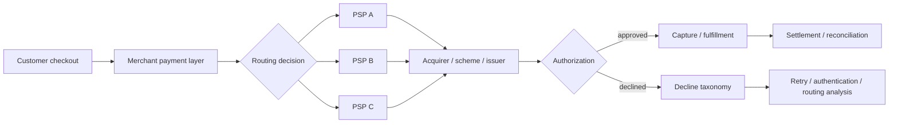

# EU Payments Acceptance Engine

A reproducible B2C payments analytics project for diagnosing authorization loss and testing routing changes across European markets.

This repository is built around a practical payments question:

> When authorization differs across PSPs, markets, devices and authentication paths, how do you decide what to change without mistaking correlation for causal uplift?

The project generates a 300,000-transaction synthetic merchant dataset, produces payment-performance diagnostics, and runs a randomized routing experiment with commercial guardrails.

## What it demonstrates

- payment authorization and decline analytics
- PSP × market performance segmentation
- 3DS / device diagnostics
- soft vs hard decline taxonomy
- routing experiment design
- SQL analysis
- reproducible synthetic data generation
- commercial decision-making with fraud, dispute, latency and cost guardrails

## Results from the seeded dataset

The synthetic data deliberately includes a Germany × PSP_B acceptance penalty so the analysis has a real diagnostic target. The report quantifies the raw gap and then refuses to treat it as causal: the recommended action is a randomized routing test.

That distinction is intentional. Payments teams should not reroute production traffic because a dashboard shows one PSP with a higher raw authorization rate.

## Architecture



## Run

```bash
python generate_data.py
python analyze.py
python experiment.py
python -m unittest discover -s tests -v
```

No external Python packages are required.

## Repository structure

- `generate_data.py` — deterministic synthetic payment generator
- `analyze.py` — authorization, decline and market/PSP diagnostics
- `experiment.py` — randomized routing experiment
- `sql/acceptance_diagnostics.sql` — analyst-style SQL queries
- `decision_memo.md` — business recommendation and rollout guardrails
- `METHODS.md` — assumptions and claim boundaries
- `DATA_DICTIONARY.md` — transaction schema
- `tests/` — reproducibility and logic checks

## Portfolio claim boundary

This is a synthetic research/portfolio environment, not production merchant data. It demonstrates payments reasoning, engineering and experimentation; it does not claim real merchant revenue uplift.
