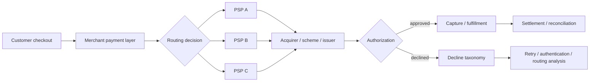

# EU Payments Acceptance Engine

[](https://github.com/layan985/eu-payments-acceptance-engine/actions/workflows/tests.yml)

A reproducible B2C payments analytics project for diagnosing authorization loss and testing routing changes across European markets.

> **Question:** when authorization differs across PSPs, markets, devices and authentication paths, how do you decide what to change without mistaking correlation for causal uplift?

The project combines **official ECB market context** with a reproducible 300,000-transaction synthetic merchant environment. The real-data layer anchors the project to the European payments market; the synthetic layer makes transaction-level routing and acceptance experiments reproducible without claiming access to private merchant data.

## Real European market context

`ecb_market_snapshot.py` pulls the latest observations for official ECB card-payment series. `ECB_MARKET_CONTEXT.md` records the H1 2025 baseline, including 44.0 billion euro-area card payments, an average card-payment value around €38.40, and 29.6 billion contactless card payments.

These aggregates are kept separate from the synthetic authorization model so market evidence is not confused with simulated transaction outcomes.

## Reproduced headline results

| Metric | Seeded result |
|---|---:|
| Overall authorization rate | 93.10% |
| Germany / PSP_A | 93.03% |
| Germany / PSP_B | 89.31% |
| Raw Germany PSP gap | 372 bps |
| Randomized treatment-control gap | ~248 bps |
| 95% CI on randomized gap | ~191–305 bps |

The 372 bp observational gap is **not** described as uplift. It identifies where to investigate. The randomized experiment demonstrates how a routing change should be evaluated.

## What it demonstrates

- payment authorization and decline analytics
- PSP × market performance segmentation
- 3DS / device diagnostics
- soft vs hard decline taxonomy
- routing experiment design with confidence intervals
- SQL analysis
- official ECB payment-statistics integration
- reproducible synthetic data generation
- commercial decision-making with fraud, dispute, latency and cost guardrails

## Architecture



## Run

```bash
python generate_data.py
python analyze.py
python experiment.py
python -m unittest discover -s tests -v
```

Optional live ECB snapshot:

```bash
python ecb_market_snapshot.py
```

No external Python packages are required.

## Repository structure

- `ecb_market_snapshot.py` — live ECB Data Portal market snapshot
- `ECB_MARKET_CONTEXT.md` — official euro-area payments baseline and series keys
- `generate_data.py` — deterministic synthetic payment generator
- `analyze.py` — authorization, decline and market/PSP diagnostics
- `experiment.py` — randomized routing experiment
- `sql/acceptance_diagnostics.sql` — analyst-style SQL queries
- `decision_memo.md` — business recommendation and rollout guardrails
- `METHODS.md` — assumptions and claim boundaries
- `DATA_DICTIONARY.md` — transaction schema
- `RESULTS.md` — concise reproduced findings
- `tests/` — reproducibility and logic checks

## Related payments projects

- [SEPA Instant + Verification of Payee Simulator](https://github.com/layan985/sepa-instant-vop-simulator)
- [Payments Reconciliation Engine](https://github.com/layan985/payments-reconciliation-engine)

## Portfolio claim boundary

The ECB market layer is real public data; the transaction-level merchant environment is synthetic. The project demonstrates payments reasoning, engineering and experimentation; it does not claim production merchant access or real merchant revenue uplift.
