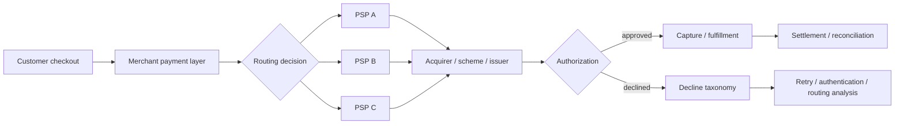

# EU Payments Acceptance Engine

[](https://github.com/layan985/eu-payments-acceptance-engine/actions/workflows/tests.yml)

A reproducible B2C payments analytics project for diagnosing authorization loss and testing routing changes across European markets.

> **Question:** when authorization differs across PSPs, markets, devices and authentication paths, how do you decide what to change without mistaking correlation for causal uplift?

The project generates a 300,000-transaction synthetic merchant dataset, produces payment-performance diagnostics, and runs a randomized routing experiment with commercial guardrails.

## Reproduced headline results

| Metric | Seeded result |
|---|---:|
| Overall authorization rate | 93.10% |
| Germany / PSP_A | 93.03% |
| Germany / PSP_B | 89.31% |
| Raw Germany PSP gap | 372 bps |
| Randomized treatment-control gap | ~248 bps |
| 95% CI on randomized gap | ~191–305 bps |

The 372 bp observational gap is **not** described as uplift. It identifies where to investigate. The randomized experiment demonstrates how a routing change should be evaluated.

## What it demonstrates

- payment authorization and decline analytics
- PSP × market performance segmentation
- 3DS / device diagnostics
- soft vs hard decline taxonomy
- routing experiment design with confidence intervals
- SQL analysis
- reproducible synthetic data generation
- commercial decision-making with fraud, dispute, latency and cost guardrails

## Architecture



## Run

```bash
python generate_data.py
python analyze.py
python experiment.py
python -m unittest discover -s tests -v
```

No external Python packages are required.

## Repository structure

- `generate_data.py` — deterministic synthetic payment generator
- `analyze.py` — authorization, decline and market/PSP diagnostics
- `experiment.py` — randomized routing experiment
- `sql/acceptance_diagnostics.sql` — analyst-style SQL queries
- `decision_memo.md` — business recommendation and rollout guardrails
- `METHODS.md` — assumptions and claim boundaries
- `DATA_DICTIONARY.md` — transaction schema
- `RESULTS.md` — concise reproduced findings
- `tests/` — reproducibility and logic checks

## Related payments projects

- [SEPA Instant + Verification of Payee Simulator](https://github.com/layan985/sepa-instant-vop-simulator)
- [Payments Reconciliation Engine](https://github.com/layan985/payments-reconciliation-engine)

## Portfolio claim boundary

This is a synthetic research/portfolio environment, not production merchant data. It demonstrates payments reasoning, engineering and experimentation; it does not claim real merchant revenue uplift.
