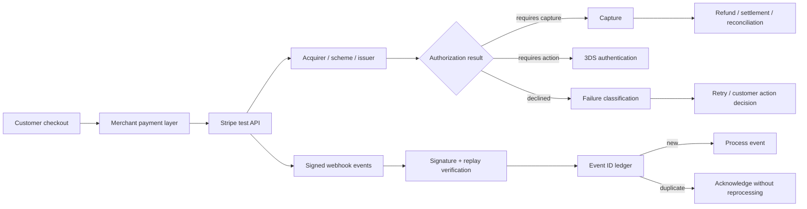

# EU Payments Acceptance Engine

[](https://github.com/layan985/eu-payments-acceptance-engine/actions/workflows/tests.yml)

A B2C payments analytics and Stripe integration project for diagnosing authorization loss, handling payment-state transitions, and deciding what to do when a payment fails.

> **Question:** when authorization differs across markets, devices and authentication paths, how do you decide what to change without mistaking correlation for causal uplift—and how do you operate the payment safely after the decision?

The project combines three layers:

1. **official ECB market data** for the real European payments baseline;
2. a reproducible **300,000-transaction synthetic merchant environment** for transaction-level experiments;
3. credential-gated **Stripe test-API execution** for payment, authentication, lifecycle and webhook verification.

## Current European market context

The latest ECB release, for H2 2025, reports **83.5 billion** euro-area non-cash payments, cards at about **57%** of payment count, and **32.9 billion** contactless card payments. The joint EBA-ECB fraud report puts the 2024 EEA fraud rate at around **0.002% of transaction value** and finds SCA remains effective against the fraud types it was designed to mitigate.

See `ECB_MARKET_CONTEXT.md` and `ecb_market_snapshot.py`.

## Reproduced experiment results

| Metric | Seeded result |
|---|---:|
| Overall authorization rate | 93.10% |
| Germany / PSP_A | 93.03% |
| Germany / PSP_B | 89.31% |
| Raw Germany PSP gap | 372 bps |
| Randomized treatment-control gap | ~248 bps |
| 95% CI on randomized gap | ~191–305 bps |

The 372 bp observational gap is **not** described as uplift. It identifies where to investigate. The randomized experiment demonstrates how a routing change should be evaluated.

## Stripe test-environment verification

The Stripe path has been exercised against Stripe's real test API using developer-owned test credentials. Retained redacted evidence covers:

- successful PaymentIntent authorization;
- deliberate generic and insufficient-funds card declines;
- a 3DS flow reaching `requires_action`;
- a separate manual-authorization → capture → refund lifecycle;
- an end-to-end Stripe CLI test webhook accepted only after `Stripe-Signature` verification.

See:

- `provider_sandboxes/evidence/stripe_2026-08-10.md`
- `provider_sandboxes/evidence/stripe_lifecycle_2026-08-10.md`
- `provider_sandboxes/evidence/stripe_webhook_2026-08-10.md`

The Stripe integration now contains five operational pieces:

- `stripe_sandbox.py` — PaymentIntent success, generic decline, insufficient-funds and 3DS-required scenarios;
- `stripe_lifecycle.py` — separate authorization and capture followed by refund;
- `stripe_webhook_server.py` — raw-body signature verification, replay tolerance and a persistent SQLite event-id ledger so duplicate deliveries can be acknowledged without processing twice;
- `stripe_failure_ops.py` — test-API failure runner covering generic decline, insufficient funds, lost/stolen card, expired card, incorrect CVC, processing errors and velocity limits;
- the analytics/experiment layer — acceptance segmentation and randomized routing evaluation with fraud, dispute, latency and cost guardrails.

Secrets are read only from local environment variables and are never committed. CI tests request construction, evidence redaction, lifecycle invariants, webhook signature verification, tamper/replay rejection, duplicate event claiming, and decline-decision behavior. Network calls remain credential-gated and are not faked in CI.

## What it demonstrates

- B2C payment acceptance and decline analytics
- 3DS / SCA diagnostics
- smart-routing experiment design with confidence intervals
- fraud, dispute, latency and cost guardrails
- executed Stripe test-environment PaymentIntent flows
- executed authorization → capture → refund lifecycle
- executed signed Stripe webhook delivery
- webhook signature verification and replay protection
- persistent duplicate-event/idempotency handling
- decline classification and retry/customer-action decisioning
- safe handling of sensitive lost/stolen/fraud-style decline messaging
- idempotency-aware API requests
- SQL analysis
- official ECB payments-statistics integration
- explicit separation of public, simulated, contract-tested and executed sandbox evidence

## Architecture



## Run

```bash
python generate_data.py
python analyze.py
python experiment.py
python -m unittest discover -s tests -v
```

Optional real-data pull:

```bash
python ecb_market_snapshot.py
```

Stripe test scenarios require `STRIPE_TEST_SECRET_KEY`:

```bash
python provider_sandboxes/stripe_sandbox.py success
python provider_sandboxes/stripe_sandbox.py generic_decline
python provider_sandboxes/stripe_sandbox.py insufficient_funds
python provider_sandboxes/stripe_sandbox.py 3ds_required
```

Run the full authorization → capture → refund test lifecycle:

```bash
python provider_sandboxes/stripe_lifecycle.py
```

Run deeper Stripe failure scenarios:

```bash
python provider_sandboxes/stripe_failure_ops.py generic_decline
python provider_sandboxes/stripe_failure_ops.py insufficient_funds
python provider_sandboxes/stripe_failure_ops.py lost_card
python provider_sandboxes/stripe_failure_ops.py stolen_card
python provider_sandboxes/stripe_failure_ops.py expired_card
python provider_sandboxes/stripe_failure_ops.py incorrect_cvc
python provider_sandboxes/stripe_failure_ops.py processing_error
python provider_sandboxes/stripe_failure_ops.py velocity_limit
```

The local webhook verifier requires `STRIPE_WEBHOOK_SECRET` and listens on `http://localhost:4242/webhook`:

```bash
python provider_sandboxes/stripe_webhook_server.py
```

## External validation

- `EXTERNAL_REVIEW.md` contains a five-question review packet for payments professionals.
- `ADOPTION.md` records independent reproduction, external review, usage and contributions.
- GitHub issue #1 is open specifically for external challenge of routing, 3DS and payment-operations assumptions.

Stars are not counted as validation.

## Related payments projects

- [SEPA Instant + Verification of Payee Simulator](https://github.com/layan985/sepa-instant-vop-simulator)
- [Payments Reconciliation Engine](https://github.com/layan985/payments-reconciliation-engine)

## Claim boundary

The ECB market layer is real public data. The core Stripe PaymentIntent scenarios, manual authorization/capture/refund lifecycle, and a signed test webhook delivery have been exercised against Stripe's test environment and redacted execution records are retained. The persistent duplicate-event ledger and expanded failure-operations runner are implemented and contract-tested; they should only be described as executed provider evidence after their own live test runs are retained. The transaction-level merchant environment is synthetic. This project does not claim production merchant access, live-money processing, certification, or real merchant revenue uplift.
