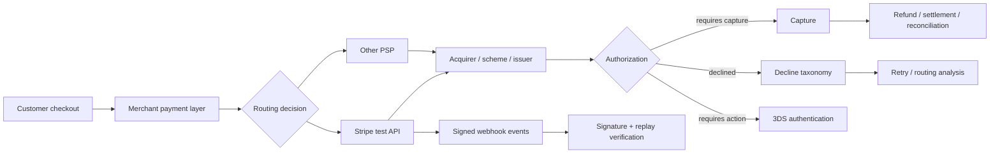

# EU Payments Acceptance Engine

[](https://github.com/layan985/eu-payments-acceptance-engine/actions/workflows/tests.yml)

A B2C payments analytics and integration project for diagnosing authorization loss, testing routing changes, and validating assumptions against the real European payments market.

> **Question:** when authorization differs across PSPs, markets, devices and authentication paths, how do you decide what to change without mistaking correlation for causal uplift?

The project combines three layers:

1. **official ECB market data** for the real European payments baseline;
2. a reproducible **300,000-transaction synthetic merchant environment** for transaction-level experiments;
3. credential-gated PSP test-environment paths, with Stripe executed against the real Stripe test API.

## Current European market context

The latest ECB release, for H2 2025, reports **83.5 billion** euro-area non-cash payments, cards at about **57%** of payment count, and **32.9 billion** contactless card payments. The joint EBA-ECB fraud report puts the 2024 EEA fraud rate at around **0.002% of transaction value** and finds SCA remains effective against the fraud types it was designed to mitigate.

See `ECB_MARKET_CONTEXT.md` and `ecb_market_snapshot.py`.

## Reproduced experiment results

| Metric | Seeded result |
|---|---:|
| Overall authorization rate | 93.10% |
| Germany / PSP_A | 93.03% |
| Germany / PSP_B | 89.31% |
| Raw Germany PSP gap | 372 bps |
| Randomized treatment-control gap | ~248 bps |
| 95% CI on randomized gap | ~191–305 bps |

The 372 bp observational gap is **not** described as uplift. It identifies where to investigate. The randomized experiment demonstrates how a routing change should be evaluated.

## Stripe test-environment verification

The Stripe path has been exercised against Stripe's real test API using developer-owned test credentials. The retained redacted evidence covers successful authorization, deliberate card declines, and a 3DS flow reaching `requires_action`; see `provider_sandboxes/evidence/stripe_2026-08-10.md`.

The Stripe integration now contains three layers:

- `stripe_sandbox.py` — PaymentIntent success, generic decline, insufficient-funds, and 3DS-required scenarios;
- `stripe_lifecycle.py` — separate authorization and capture followed by a full refund (`requires_capture` → `succeeded` → refund);
- `stripe_webhook_server.py` — local webhook endpoint that verifies the raw-body `Stripe-Signature` HMAC and enforces a five-minute replay tolerance before accepting an event.

Secrets are read only from local environment variables and are never committed. CI tests request construction, evidence redaction, manual-capture payloads, webhook signature verification, tamper rejection, and replay rejection. Network calls remain credential-gated and are not faked in CI.

## What it demonstrates

- B2C payment acceptance and decline analytics
- PSP × market performance segmentation
- 3DS / SCA diagnostics
- smart-routing experiment design with confidence intervals
- fraud, dispute, latency and cost guardrails
- executed Stripe test-environment PaymentIntent flows
- separate authorization and capture lifecycle design
- refund handling
- webhook signature verification and replay protection
- idempotency-aware provider requests
- SQL analysis
- official ECB payments-statistics integration
- clear separation of public, simulated and sandbox evidence

## Architecture



## Run

```bash
python generate_data.py
python analyze.py
python experiment.py
python -m unittest discover -s tests -v
```

Optional real-data pull:

```bash
python ecb_market_snapshot.py
```

Stripe test scenarios require `STRIPE_TEST_SECRET_KEY`:

```bash
python provider_sandboxes/stripe_sandbox.py success
python provider_sandboxes/stripe_sandbox.py generic_decline
python provider_sandboxes/stripe_sandbox.py insufficient_funds
python provider_sandboxes/stripe_sandbox.py 3ds_required
```

Run the full authorization → capture → refund test lifecycle:

```bash
python provider_sandboxes/stripe_lifecycle.py
```

The local webhook verifier requires `STRIPE_WEBHOOK_SECRET` and listens on `http://localhost:4242/webhook`:

```bash
python provider_sandboxes/stripe_webhook_server.py
```

## External validation

- `EXTERNAL_REVIEW.md` contains a five-question review packet for payments professionals.
- `ADOPTION.md` records independent reproduction, external review, usage and contributions.
- GitHub issue #1 is open specifically for external challenge of routing, 3DS and PSP assumptions.

Stars are not counted as validation.

## Related payments projects

- [SEPA Instant + Verification of Payee Simulator](https://github.com/layan985/sepa-instant-vop-simulator)
- [Payments Reconciliation Engine](https://github.com/layan985/payments-reconciliation-engine)

## Claim boundary

The ECB market layer is real public data. The Stripe PaymentIntent scenarios have been exercised against Stripe's test API and redacted evidence is retained in the repository. The new authorization/capture/refund lifecycle and webhook receiver are implemented and contract-tested; they should only be described as executed provider evidence after their own credential-gated runs are retained. The transaction-level merchant environment is synthetic. This project does not claim production merchant access, live-money processing, certification, or real merchant revenue uplift.
